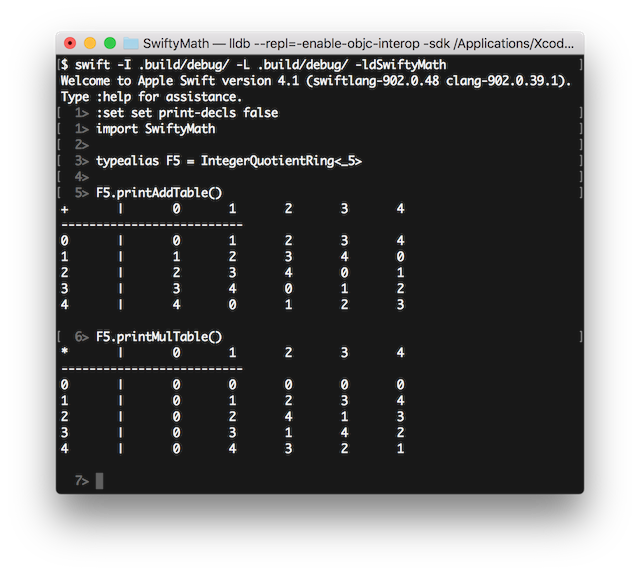

# Swifty Algebra

A Swift playground for [Abstract Algebra](https://en.wikipedia.org/wiki/Abstract_algebra).
This project is intended to understand Algebra by implementing abstract concepts and playing with concrete objects such as Numbers, Matrices, Polynomials, etc.

## How to Build / Run

Open `SwiftyAlgebra.xcworkspace` and press ▶️ to build the framework. 
You can run the playgrounds under the project.  



Or you can run on REPL by:  

```
$ make repl
```


## Examples

### Rational Numbers

```swift
typealias Q = RationalNumber

let a = Q(4, 5)  // 4/5
let b = Q(3, 2)  // 3/2

a + b  // 23/10
a * b  // 6/5
b / a  // 15/8
```

### Matrices (type safe)

```swift
typealias Z = IntegerNumber
typealias M = Matrix<Z, _2, _2>

let a = M(1, 2, 3, 4)  // [1, 2; 3, 4]
let b = M(2, 1, 1, 2)  // [2, 1; 1, 2]

a + b  // [3, 3; 4, 6]
a * b  // [4, 5; 10, 11]

a + b == b + a  // true: addition is commutative
a * b == b * a  // false: multiplication is noncommutative
```

### Permutation (Symmetric Group)

```swift
typealias S_5 = Permutation<_5>

let s = S_5(cyclic: 0, 1, 2) // cyclic notation
let t = S_5([0: 2, 1: 3, 2: 4, 3: 0, 4: 1]) // two-line notation

s[1]  // 2
t[2]  // 4

(s * t)[3]  // 3 -> 0 -> 1
(t * s)[3]  // 3 -> 3 -> 0
```

### Polynomials

```swift
typealias Q = RationalNumber
typealias Qx = Polynominal<Q>

let f = Qx(0, 2, -3, 1) // x^3 − 3x^2 + 2x
let g = Qx(6, -5, 1)    // x^2 − 5x + 6
    
f + g  // x^3 - 2x^2 - 3x + 6
f * g  // x^5 - 8x^4 + 23x^3 - 28x^2 + 12x
f % g  // 6x - 12
    
gcd(f, g) // 6x - 12
```

### Integer Quotients, Finite Fields

```swift
typealias Z_4 = IntegerQuotientRing<_4>
Z_4.printAddTable()
```
```
+	|	0	1	2	3
----------------------
0	|	0	1	2	3
1	|	1	2	3	0
2	|	2	3	0	1
3	|	3	0	1	2
```

```swift
typealias F_5 = IntegerQuotientField<_5>
F_5.printMulTable()
```
```
*	|	0	1	2	3	4
--------------------------
0	|	0	0	0	0	0
1	|	0	1	2	3	4
2	|	0	2	4	1	3
3	|	0	3	1	4	2
4	|	0	4	3	2	1
```

### Algebraic Extension

```swift
// Construct an algebraic extension over Q:
// K = Q(√2) = Q[x]/(x^2 - 2).

typealias Q = RationalNumber

struct p: _Polynomial {                            // p = x^2 - 2, as a struct
    typealias K = Q
    static let value = Polynomial<Q>(-2, 0, 1)
}

typealias I = PolynomialIdeal<p>                   // I = (x^2 - 2)
typealias K = QuotientField<Polynomial<Q>, I>      // K = Q[x]/I

let a = Polynomial<Q>(0, 1).asQuotient(in: K.self) // a = x mod I
a * a == 2                                         // true!
```

### Homology, Cohomology

```swift
let S2 = SimplicialComplex.sphere(dim: 2)
let H = Homology(S2, Z.self)
print("H(S^2; Z) =", H.detailDescription, "\n")
```

```
H(S^2; Z) = {
  0 : Z,    [(v1)],
  1 : 0,    [],
  2 : Z,    [-1(v0, v2, v3) + -1(v0, v1, v2) + (v1, v2, v3) + (v0, v1, v3)]
}
```

```swift
let RP2 = SimplicialComplex.realProjectiveSpace(dim: 2)
let H = Homology(RP2, Z_2.self)
print("H(RP^2; Z/2) =", H.detailDescription, "\n")
```

```
H(RP^2; Z/2) = {
  0 : Z/2,    [(v1)],
  1 : Z/2,    [(v0, v1) + (v1, v2) + (v0, v3) + (v2, v3)],
  2 : Z/2,    [(v0, v2, v3) + (v3, v4, v5) + (v2, v3, v5) + (v1, v2, v5) + (v0, v4, v5) + (v1, v3, v4) + (v0, v1, v5) + (v1, v2, v4) + (v0, v2, v4) + (v0, v1, v3)]
}
```

## References

1. [Swift で代数学入門](http://qiita.com/taketo1024/items/bd356c59dc0559ee9a0b)
2. [Swift で数学のススメ](https://www.slideshare.net/taketo1024/swift-79828803)

## License
**Swifty Algebra** is licensed under [CC0 1.0 Universal](LICENSE).
