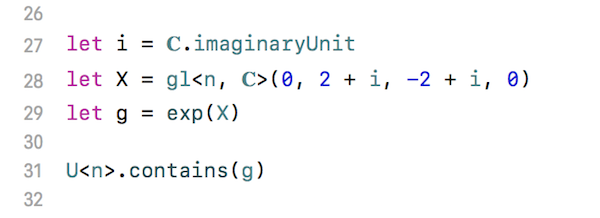

# SwiftyMath



The aim of this project is to understand Mathematics by realizing abstract concepts as codes. Mathematical axioms correspond to `protocol`s, and objects satisfying some axioms correspond to `struct`s.

## How to Build / Run

With [Xcode](https://developer.apple.com/xcode/) installed, type:

```
$ swift run
```

To activate playgrounds, first type:

```
$ swift package generate-xcodeproj
```

then open `SwiftyMath.xcworkspace` and press ▶️  to build the framework. 

## Creating Your Own Project

### 1. Initialize a Package

```
$ mkdir YourProject
$ cd YourProject
$ swift package init --type executable
```

### 2. Edit `Package.swift`

```diff
 // swift-tools-version:4.0
 // The swift-tools-version declares the minimum version of Swift required to build this package.
 
 import PackageDescription
 
 let package = Package(
     name: "YourProject",
     dependencies: [
         // Dependencies declare other packages that this package depends on.
-        // .package(url: /* package url */, from: "1.0.0"),
+        .package(url: "https://github.com/taketo1024/SwiftyMath.git", from: "0.1.0"),
     ],
     targets: [
         // Targets are the basic building blocks of a package. A target can define a module or a test suite.
         // Targets can depend on other targets in this package, and on products in packages which this package depends on.
         .target(
             name: "YourProject",
-            dependencies: []),
+            dependencies: ["SwiftyMath", "SwiftyTopology"]),
     ]
 )
```

### 3. Edit `Sources/YourProject/main.swift`

```swift
import SwiftyMath
import SwiftyTopology

let S2 = SimplicialComplex.sphere(dim: 2)
let H = Homology(S2, 𝐙.self)

print(S2.detailDescription)
print(H.detailDescription)
```

### 4. Run

```
$ swift run
```

```
S^2 {
    0: v₁, v₂, v₃, v₀
    1: (v₁, v₂), (v₁, v₃), (v₂, v₃), (v₀, v₂), (v₀, v₃), (v₀, v₁)
    2: (v₁, v₂, v₃), (v₀, v₂, v₃), (v₀, v₁, v₃), (v₀, v₁, v₂)
}
H(S^2; 𝐙) = {
    0 : 𝐙,  [v₀],
    1 : 0,  [],
    2 : 𝐙,  [(v₀, v₂, v₃) + -1(v₁, v₂, v₃) + -1(v₀, v₁, v₃) + (v₀, v₁, v₂)]
}
```

## Using Mathematical Symbols

We make use of mathematical symbols such as sets 𝐙, 𝐐, 𝐑, 𝐂 and operators ⊕, ⊗ etc. Copy the folder `CodeSnippets` to `~/Library/Xcode/UserData/` then you can quickly input these symbols by the completion of Xcode.


## Examples

### Rational Numbers

```swift
let a = 𝐐(4, 5)  // 4/5
let b = 𝐐(3, 2)  // 3/2

a + b  // 23/10
a * b  // 6/5
b / a  // 15/8
```

### Matrices (type safe)

```swift
typealias M = Matrix<_2, _2, 𝐙> // Matrix of integers with fixed size 2×2.

let a = M(1, 2, 3, 4)  // [1, 2; 3, 4]
let b = M(2, 1, 1, 2)  // [2, 1; 1, 2]

a + b  // [3, 3; 4, 6]
a * b  // [4, 5; 10, 11]

a + b == b + a  // true: addition is commutative
a * b == b * a  // false: multiplication is noncommutative
```

### Permutation (Symmetric Group)

```swift
typealias S_5 = Permutation<_5>

let s = S_5(cyclic: 0, 1, 2) // cyclic notation
let t = S_5([0: 2, 1: 3, 2: 4, 3: 0, 4: 1]) // two-line notation

s[1]  // 2
t[2]  // 4

(s * t)[3]  // 3 -> 0 -> 1
(t * s)[3]  // 3 -> 3 -> 0
```

### Polynomials

```swift
typealias P = Polynominal<𝐐>

let f = P(0, 2, -3, 1) // x^3 − 3x^2 + 2x
let g = P(6, -5, 1)    // x^2 − 5x + 6
    
f + g  // x^3 - 2x^2 - 3x + 6
f * g  // x^5 - 8x^4 + 23x^3 - 28x^2 + 12x
f % g  // 6x - 12
    
gcd(f, g) // 6x - 12
```

### Integer Quotients, Finite Fields

```swift
typealias Z_4 = IntegerQuotientRing<_4>
Z_4.printAddTable()
```
```
+	|	0	1	2	3
----------------------
0	|	0	1	2	3
1	|	1	2	3	0
2	|	2	3	0	1
3	|	3	0	1	2
```

```swift
typealias F_5 = IntegerQuotientField<_5>
F_5.printMulTable()
```
```
*	|	0	1	2	3	4
--------------------------
0	|	0	0	0	0	0
1	|	0	1	2	3	4
2	|	0	2	4	1	3
3	|	0	3	1	4	2
4	|	0	4	3	2	1
```

### Mathic Extension

```swift
// Construct an algebraic extension over 𝐐:
// K = 𝐐(√2) = 𝐐[x]/(x^2 - 2).

struct p: _Polynomial {                            // p = x^2 - 2, as a struct
    typealias K = 𝐐
    static let value = Polynomial<𝐐>(-2, 0, 1)
}

typealias I = PolynomialIdeal<p>                   // I = (x^2 - 2)
typealias K = QuotientField<Polynomial<𝐐>, I>      // K = 𝐐[x]/I

let a = Polynomial<𝐐>(0, 1).asQuotient(in: K.self) // a = x mod I
a * a == 2                                         // true!
```

### Homology, Cohomology

```swift
let S2 = SimplicialComplex.sphere(dim: 2)
let H = Homology(S2, 𝐙.self)
print("H(S^2; 𝐙) =", H.detailDescription, "\n")
```

```
H(S^2; 𝐙) = {
  0 : 𝐙,    [(v1)],
  1 : 0,    [],
  2 : 𝐙,    [-1(v0, v2, v3) + -1(v0, v1, v2) + (v1, v2, v3) + (v0, v1, v3)]
}
```

```swift
let RP2 = SimplicialComplex.realProjectiveSpace(dim: 2)
let H = Homology(RP2, 𝐙₂.self)
print("H(RP^2; 𝐙₂) =", H.detailDescription, "\n")
```

```
H(RP^2; 𝐙₂) = {
  0 : 𝐙₂,    [(v1)],
  1 : 𝐙₂,    [(v0, v1) + (v1, v2) + (v0, v3) + (v2, v3)],
  2 : 𝐙₂,    [(v0, v2, v3) + (v3, v4, v5) + (v2, v3, v5) + (v1, v2, v5) + (v0, v4, v5) + (v1, v3, v4) + (v0, v1, v5) + (v1, v2, v4) + (v0, v2, v4) + (v0, v1, v3)]
}
```

## References

1. [Swift で代数学入門](http://qiita.com/taketo1024/items/bd356c59dc0559ee9a0b)
2. [Swift で数学のススメ](https://www.slideshare.net/taketo1024/swift-79828803)

## License
**Swifty Math** is licensed under [CC0 1.0 Universal](LICENSE).
